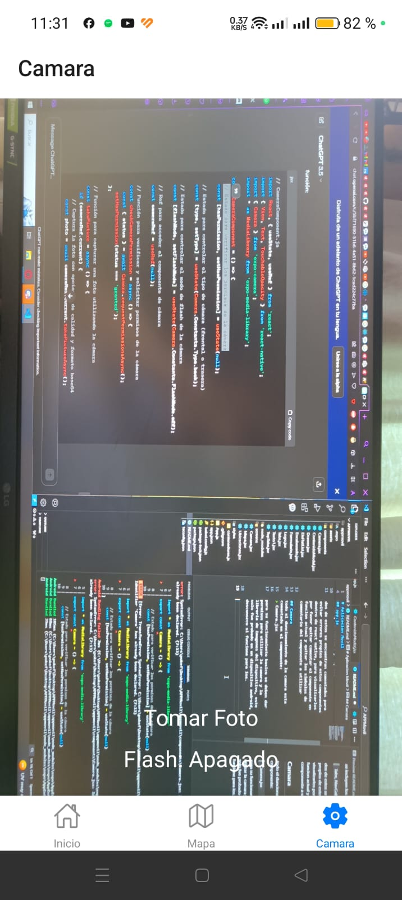

# Aplicacion Movil
Esta aplicacion movil fue elaborada como repaso de las clases 2 a la 4, por eso en su interior hay componentes que no se solicitaron en las tareas, esta incluye ademas 3 componentes de navegacion (Tabs,Drawer,TopTabs) y **2 componentes de uso de hardware, siendo implementados en la camara en su uso de camara y en el uso de almacenamiento.**
## Contenido
Contiene las respectivas carpetas de components para los componentes utilizados, cada uno de estos con su debida exportacion e importacion de paquetes y funciones.
## app.js
en la parte de 
>export default function App()

se incluyen los componentes:
> Tabs, NavGabetero y TopTabs

dos de estos se encuentran comentados para evitar errores propios de estos componentes dentro de react native, para visualizarlos por favor quitar comentar el componente en funcion actual y quitar los simbolos de comentario del componente a utilizar

## Camara
todo el duncionamiento de la camara esta comentado en el componente:
> Camera.jsx

para su funcionamiento basico se deben dar permisos para utilizar la camara y la libreria de imagenes del dispositivo, este solo fue probado en un dispositivo android, desconozco si funcione para ios.

_NOTA_: el flash funciona hasta el momento de presionar la opcion de tomar fotografia, si este esta encendido se enciende, si esta apagado permanecera apagado al momento de tomar una fotografia.

Evidencia de su funcionamiento:

